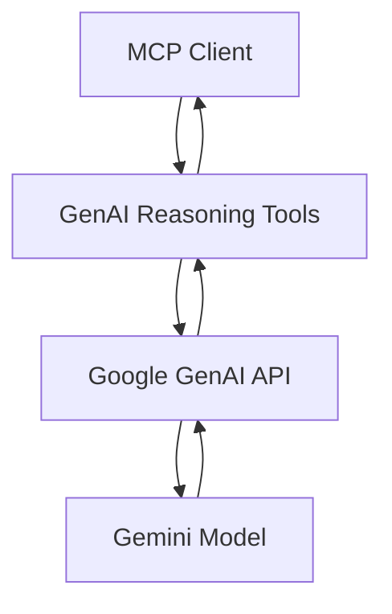

# Google GenAI Integration

This document describes the Google GenAI integration that enhances our reasoning tools with AI-powered capabilities.

## Overview

Instead of implementing complex reasoning algorithms in TypeScript, we leverage Google's Generative AI models (Gemini) to provide sophisticated reasoning capabilities. This architectural shift offers:

- **Simpler codebase** - No complex reasoning algorithms to maintain
- **More powerful reasoning** - Google's AI models provide advanced analytical capabilities  
- **AI-to-AI collaboration potential** - Multiple AI instances can use the same reasoning backend
- **Automatic improvements** - As Google improves their models, our reasoning gets better

## Architecture

The GenAI integration replaces our traditional `ReasoningTools` with `GenAIReasoningTools` that:

1. **Take reasoning requests** from MCP clients
2. **Format sophisticated prompts** for Google's Gemini models
3. **Call Google GenAI API** to perform actual reasoning
4. **Parse and structure responses** back to standard MCP tool format



## Configuration

### Environment Variables

- `GOOGLE_GENAI_API_KEY` - Your Google AI Studio API key (required)

### Configuration Parameters

The system uses these configurable parameters:

| Parameter | Default | Description |
|-----------|---------|-------------|
| `genai.api_key` | `""` | API key (prefer environment variable) |
| `genai.model_name` | `"gemini-pro"` | Gemini model to use |
| `genai.max_prompt_length` | `8000` | Maximum prompt length |
| `genai.response_timeout_ms` | `30000` | API timeout in milliseconds |
| `genai.enable_fallback` | `true` | Fall back to traditional reasoning on failure |

## Setup Instructions

### 1. Get Google AI Studio API Key

1. Visit [Google AI Studio](https://makersuite.google.com/app/apikey)
2. Create a new API key
3. Copy the API key

### 2. Configure Environment

Set the API key in your environment:

```bash
export GOOGLE_GENAI_API_KEY="your-api-key-here"
```

Or in Windows PowerShell:
```powershell
$env:GOOGLE_GENAI_API_KEY="your-api-key-here"
```

### 3. Restart the MCP Server

The system automatically detects the API key and uses GenAI-powered reasoning:

```bash
docker-compose down
docker-compose up --build -d
```

You'll see these log messages when GenAI is active:
```
🧠 Using Google GenAI-powered reasoning tools
💬 Adding conversational GenAI tools for natural dialogue
```

Without the API key, it falls back to traditional reasoning:
```
🧠 Using traditional reasoning tools (set GOOGLE_GENAI_API_KEY for GenAI)
```

## Enhanced Capabilities

### Sequential Thinking

The `sequential_thinking` tool now provides:

- **Deep analytical reasoning** powered by Gemini
- **Sophisticated hypothesis generation** and verification
- **Alternative approach exploration** and pattern recognition
- **Structured JSON responses** with insights, conclusions, and next steps
- **Branching logic support** for complex reasoning paths

### Conversational GenAI Tools ✨

**NEW**: We've added simple, secure conversational tools that provide a more natural way to interact with Gemini:

- **`genai_converse`**: Direct Q&A for immediate reasoning and analysis
- **`genai_reasoning_chat`**: Multi-turn conversations that maintain context

**Key benefits:**
- 🔒 **Built-in security** against prompt injection attacks
- 💬 **Natural conversation** without complex prompt engineering  
- 🚀 **Lightweight and fast** with minimal overhead
- 🛡️ **Automatic sanitization** of inputs and outputs

See [Conversational GenAI Documentation](./CONVERSATIONAL_GENAI.md) for detailed usage examples.

### Response Format

GenAI reasoning tools return enhanced responses:

```json
{
  "thoughtNumber": 1,
  "totalThoughts": 3,
  "nextThoughtNeeded": true,
  "analysis": "Deep AI-generated analysis...",
  "insights": ["Insight 1", "Insight 2"],
  "hypothesis": "Primary hypothesis emerging from analysis",
  "verification": "Method to test the hypothesis",
  "nextSteps": ["Next step 1", "Next step 2"],
  "alternatives": ["Alternative approach 1"],
  "conclusion": "Summary and recommendations",
  "confidence": 0.85,
  "aiPowered": true,
  "model": "gemini-pro",
  "timestamp": "2024-01-15T10:30:00.000Z"
}
```

## AI-to-AI Collaboration Potential

This integration creates the foundation for AI-to-AI collaboration:

1. **Multiple AI instances** can use the same GenAI reasoning backend
2. **Shared reasoning context** through Google's cloud infrastructure  
3. **Coordination possibilities** via Google's other APIs (Firestore, Pub/Sub)
4. **Scalable architecture** for distributed AI collaboration

## Troubleshooting

### Common Issues

**API Key Issues:**
- Ensure `GOOGLE_GENAI_API_KEY` is set correctly
- Verify API key is valid in Google AI Studio
- Check API key has proper permissions

**Rate Limiting:**
- Google AI Studio has rate limits
- The system includes timeout handling
- Consider upgrading to paid tier for higher limits

**Model Errors:**
- Default model is `gemini-pro`
- Can be changed via `genai.model_name` configuration
- Check Google AI Studio for available models

### Logs and Debugging

Monitor these log messages:

- `🧠 Using Google GenAI-powered reasoning tools` - GenAI active
- `GenAI reasoning error:` - API call failures
- `GenAI prompt length (X) exceeds max (Y)` - Prompt too long

## Development

### Adding New GenAI Tools

To extend the GenAI integration:

1. Add new methods to `GenAIReasoningTools` class
2. Create appropriate prompt templates
3. Update the `GenAIReasoningToolsWrapper` execute method
4. Add tool definitions to `GENAI_REASONING_TOOLS`

### Testing

Test the integration by calling the reasoning tools with an API key set:

```javascript
// This will use GenAI if API key is configured
await mcp.execute('sequential_thinking', {
  thought: 'How can AI-to-AI collaboration work?',
  thought_number: 1,
  total_thoughts: 3,
  next_thought_needed: true
});
```

## Future Enhancements

Potential expansions of the GenAI integration:

- **Multi-modal reasoning** with Gemini Vision
- **Code generation tools** powered by GenAI
- **Real-time collaboration** via Google Cloud services
- **Advanced prompt engineering** with few-shot examples
- **Custom model fine-tuning** for domain-specific reasoning

## Security Considerations

- API keys should be stored securely (environment variables preferred)
- Prompts may contain sensitive information sent to Google's servers
- Consider data residency requirements for your use case
- Review Google's data usage policies for AI Studio 